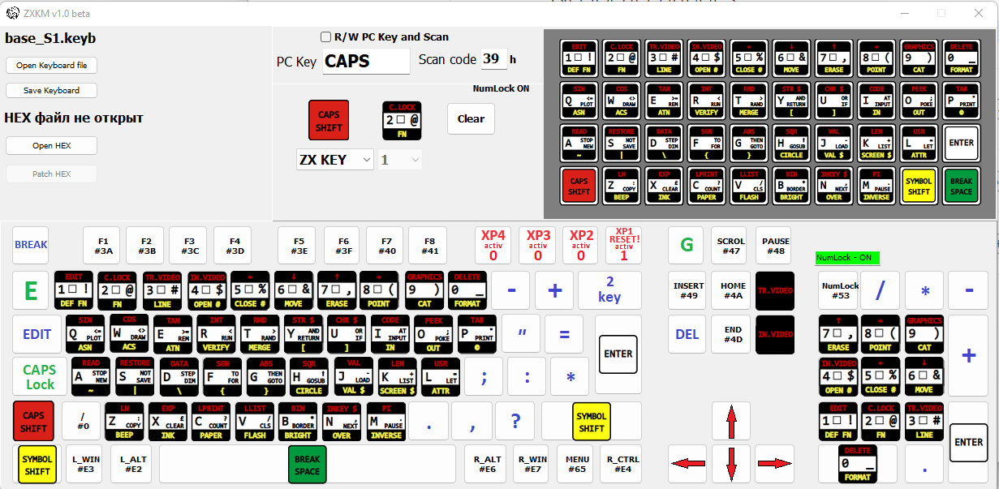

# ZXKM
**29.12.2023 - Из-за индикации NumLock некоторые клавиатуры работают некорректно.
		Теперь индикатор инициализации клавиатуры led ScrollLock.**

**29.12.2023 - Убрал термины Magic, Turbo. Теперь они именуются номером штырька разъёма XT.**
  
  
**Разъем программатора АVR на всех версиях AVR-ISP, ошибочно подписан AVR JTAG.**   
		

Предназначен для подключения к Spectrum-совместимым компьютерам, имеющим NemoBUS, HID устройств - 
в частности, USB клавиатуру и мышь. В каждый USB порт можно подключить беспроводную пару клава/мышь, 
либо переходник 2xPS/2->USB.   
Так же могут найти применение другие HID устройства ввода, например графический планшет.

ZXKM успешно работает на следующих компах: Scorpion GMX, Scorpion ZS 256k, Pentagon 128 классика и 2.666, Jasper, Мастер.
**Не использует WAIT**, работает параллельно с основной механической клавиатурой.  
**Не работает на ZX Evo.**
Раскладка клавиатуры и управление дополнительными кнопками может быть изменена при помощи ПО, путём модификации прошивки.  
В исходнике ничего править не надо.

 Сигнал **/DOS** присутствует во всех версиях но не используется. В версии 1.0 он сразу заходит на вывод EPM7128. Подключение к оригинальному ZX, 
 без модификации платы НЕДОПУСТИМО ! 
 В версиях выше 1.0, при необходимости, сигнал **/DOS** подключается перемычкой.
	Сигнал **/Reset** заведён в BUS во всех версиях.

**v1.0** - Должен быть установлен джампер JP1 замыкающий RXD-TXD.  
**v1.0 , v1.1** - управление кнопками Тurbo и Magic выведены на раъем программатора. см. рисунок Magic-Turbo.png  
**v1.1** - Reset, дополнительно выведен на отдельный пин. Добавлен XP2 - для расширения
       функционала (управление какой либо дополнительной внешней кнопкой).
       Сигнал /DOS в текущей прошивке не используется, т.к. Kempston JOY не реализован.  
Добавлены перемычки S0,S1 для дальнейшего развития.  
**v1.4** - Все внешние подключения выведены на дополнительный разъём. Назначение XP1-4 задаются в ПО.  
Добавлены перемычки S0,S1 для дальнейшего развития.

**v2.0** - Это последняя версия. Тоже что и v1.4 c изменением протокола обмена между МК и ПЛИС.

**+SDv1.0 +SDv1.1** - В версии 1.0 присутствовал лишний резистор, в +SDv1.1 он уже отсутствует. 

**---------------------------------------------------------------------------------------------------**

**Распиновка разъёма XP.**

ХP1- reset

XP2- по умолчанию заведён на F11.

XP3- по умолчанию заведён на F10.

XP4,5- в данный момент не используются.

TXD- для отладки и контроля. Не используется.

**---------------------------------------------------------------------------------------------------**

**Распиновка внешнего разъёма USB аналогична распиновке USB планки PC.**

**---------------------------------------------------------------------------------------------------**

**Разъём программатора ATMEGA.**

**---------------------------------------------------------------------------------------------------**

**Разъём программатора ATMEL.**

**---------------------------------------------------------------------------------------------------**

**Распиновка разъёма для внешней SD карты.**

**---------------------------------------------------------------------------------------------------**		 		

**Свериться с своим BUS.    
Если собираете самостоятельно, первым чипом шить ALTERA.    
Запаять (замкнуть) S0.    
Активность LED при подключенной клавиатуре/мыши, свидетельствует об исправном CH9350.**		 

**---------------------------------------------------------------------------------------------------**		

### Клавиатура:
Прошивка "по умолчанию" содержит раскладку всех основных клавиш ZX Spectrum. 
Привязку кнопок ZX к РС клавиатуре можно изменить с помощью прилагаемого ПО.
Так же, на любую РС клавишу можно назначить сочетание двух клавиш ZX. Например - **СS+T, SS+P**.  
Клавиша "Delete" аналогично РС удаляет символ справа. Если справа символа нет, удаляет слева.

В процессе работы, клавиатуру можно запрограммировать на собственные макросы.

Вход в режим программирования:
1. Нажимаем **Win+BackSpace** - замигал SclollLock.
2. Вводим любые комманды. Макрос ограничен 32-мя клавишами.
   В случае ошибки, жмём **ESC** и начинаем с пункта 1.
3. После ввода, нажимаем **F1-F9**. К этой **Fх** привяжется всё набранное.
Макрос запоминается в энергонезависимой памяти.
  
### Мышь: 

Разрешение(скорость) меняется нажатием **win+1,2,3,4**. Это коэффициент делителя.

**win+0** - инверсия кнопок.

**win+9** - инверсия колеса - **реализовано**

Эти настройки запоминаются в энергонезависимой памяти.

### Использование ПО:
  
**Мануал и видео в работе.**

